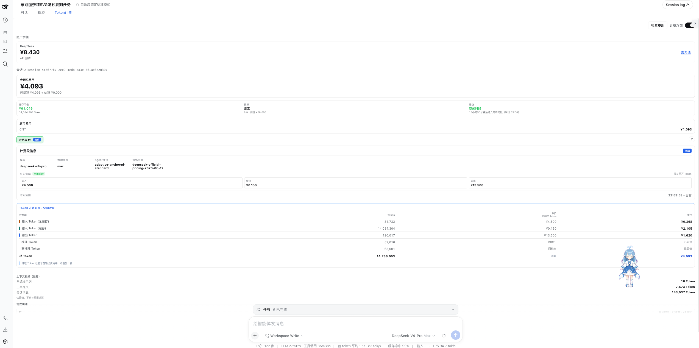
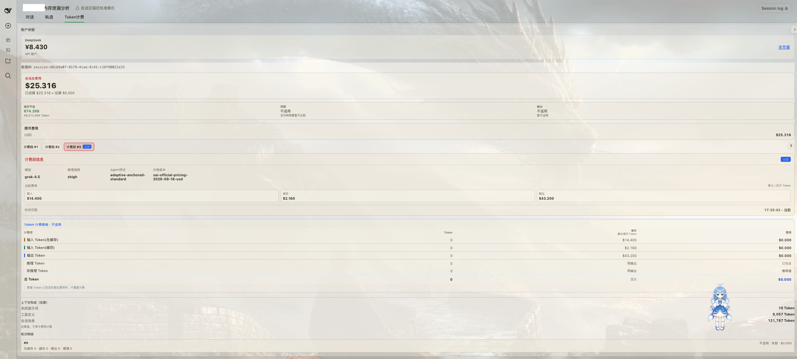
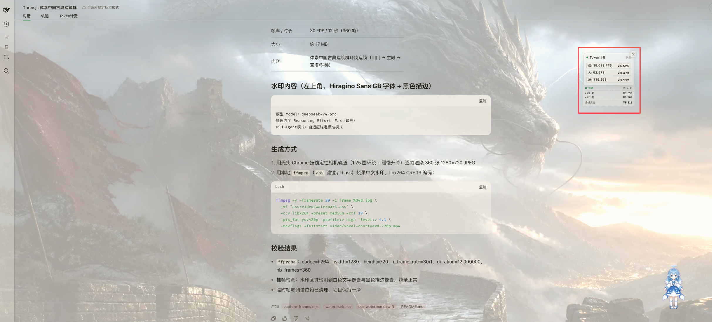

# dsh-cost-meter


[](LICENSE)

dsh-cost-meter is a multi-provider LLM token cost meter plugin for dsh / DeepSeek Harness. It converts local request usage into a traceable local ledger and real-time billing views.

> [!WARNING]
> dsh-cost-meter is a local observability, estimation, and replay tool. It is not the official bill from DeepSeek, OpenAI, Anthropic, xAI, or any model provider. Pricing snapshots ship with plugin releases; streaming output is estimated first and corrected when provider usage arrives. Treat provider consoles, invoices, and actual charges as the source of truth.

## UI And Demos

The screenshots below show the main flows in a dsh Web profile. Balances, sessions, token counts, and amounts are simulated examples and do not represent a real account or provider invoice.

### Token Billing View

The Token billing view shows balance, session cost, budget status, cache savings, model pricing version, and bucketed input (uncached), input (cached), output, and reasoning tokens.



When usage data is unavailable or a model cannot be matched to a price, the view explicitly reports an unavailable or estimated state instead of presenting a false precise amount.



### Conversation View And Token Widget

The small widget in the upper-right corner of the conversation view provides a quick readout of the current request's tokens and cost. Open it to jump to the full Token billing view for session and turn details.



### Token Widget Videos

The videos are stored in `docs/assets`. You can play them from the links below on GitHub; clients with HTML5 video support may also show an inline player.

<video controls preload="metadata" width="320" src="docs/assets/video1.mp4"></video>

[Play video 1: Token widget basics in dark theme (about 15 seconds)](docs/assets/video1.mp4)

<video controls preload="metadata" width="320" src="docs/assets/video2.mp4"></video>

[Play video 2: Token widget generation flow in light theme (about 23 seconds)](docs/assets/video2.mp4)

## Highlights

- Multi-provider pricing catalog: versioned snapshots are registered for DeepSeek, xAI, OpenAI, Anthropic, Google Gemini, Moonshot/Kimi, MiniMax, Mistral, Groq, Together, Fireworks, and Cerebras.
- Token-bucket billing: separates uncached input, cached input, and output tokens; reasoning tokens are shown as included in output cost.
- Live receipt and final settlement: streaming output is estimated during generation, then replaced by settled events when `assistant/message.usage` arrives.
- Session-level tracking: current request, current session, local total, session list, stage tabs, turn details, model, reasoning effort, agent preset, and pricing version.
- Cost insights: the session and global views show budget progress and the DeepSeek peak/off-peak countdown; session cache-hit savings are shown when unit prices are unambiguous, and cost trees / trends / exports are available through on-demand Remote APIs.
- Local durable ledger: the release package defaults to `$DSH_HOME/mymeter/ledger.json` with `ledgerFormat: json`, restoring aggregates after restart; `ledgerFormat: append` can be explicitly opted in.
- On-demand analysis APIs: Host Remote exposes the session cost tree, trend/anomaly report, and CSV/JSON ledger export without putting those larger objects into the default snapshot.
- Host/Client boundary: API keys, ledger files, and balance requests stay on the Host; the Client receives sanitized display DTOs only.
- Native dsh integration: registers `shell.overlay`, `conversation.view`, and the dsh plugin settings card, while following dsh global theme variables.

## Quick Start

1. Install the published package from npm (recommended):

   ```bash
   dsh plugin --profile web add @mymeter/dsh-cost-meter
   ```

   The current `latest` version is `0.2.0`; see the [npm package](https://www.npmjs.com/package/@mymeter/dsh-cost-meter).

2. For source validation or development, build, pack, and verify the tarball from this repository:

   ```bash
   npm ci
   npm run build
   npm run pack:plugin
   npm run verify:package
   ```

3. Install the generated local tarball:

   ```bash
   dsh plugin --profile web add ./mymeter-dsh-cost-meter-0.2.0.tgz
   ```

4. Restart or reload the target dsh Web profile, then open a session. Use the floating receipt in the conversation page, or open the `Token计费` conversation view for balances, stages, and token details.

> [!NOTE]
> The npm package is now published. If your dsh profile uses a custom registry, make sure
> that registry can resolve `@mymeter/dsh-cost-meter`; the local tarball remains useful for offline validation and development.

See [Getting Started](docs/getting-started.md) for the full install and troubleshooting flow.

## Provider Support

| Capability | Current status |
| --- | --- |
| Cost estimation | DeepSeek, xAI, OpenAI, Anthropic, Google Gemini, Moonshot/Kimi, MiniMax, Mistral, Groq, Together, Fireworks, Cerebras |
| DeepSeek balance | `deepseek-official` is wired to `/user/balance`, with CNY/USD balances and low-balance warnings |
| Other public balance candidates | OpenRouter, Moonshot/Kimi, xAI, Vercel AI Gateway, and similar providers require dedicated adapters and permission semantics |
| Unsupported balances | Providers without a balance adapter are hidden from the balance area; only DeepSeek is shown today |
| Subscription, proxy, and gateway routes | When no route-specific token price exists, dsh-cost-meter estimates by the identifiable underlying provider API price |

See [Pricing catalog sources and coverage](docs/pricing-catalog.md) for current pricing support.

## Documentation

- [Getting Started](docs/getting-started.md): install, first validation, UI, configuration, credentials, update, uninstall, backup cleanup, and troubleshooting.
- [Billing Semantics](docs/billing.md): estimates and settlements, token buckets, peak pricing, currencies, and catalog resolution.
- [Data And Privacy](docs/privacy.md): local data, credential boundaries, network requests, deletion, and self-update permissions.
- [FAQ](docs/faq.md): cost differences, unknown models, balances, history, and installation questions.
- [Architecture](docs/architecture.md): module boundaries, event flow, billing state, ledger, Remote DTOs, and release builds.
- [Pricing Catalog Coverage](docs/pricing-catalog.md): provider pricing snapshots, route aliases, and unknown-model handling.
- [Changelog](CHANGELOG.md): release changes and verification notes.
- [中文 README](README.md): Chinese project homepage.

## Status And Limits

- This is an early preview. It has passed plugin build checks, `npm run verify:package`, tarball consumer checks, and isolated dsh profile install/Web/uninstall/reinstall validation.
- `@mymeter/dsh-cost-meter@0.2.0` is published to the npm registry. New profiles can install it directly, and existing installations can use the loopback Web UI update check. Self-update still requires a `file:` baseUrl that resolves to the local dsh profile directory.
- The final tarball has completed isolated profile validation; a real DeepSeek API key has not yet been used to reconcile production request usage and cost, and a real account balance has not yet been reconciled.
- Pricing tables ship with code. The repository includes library-level signed-manifest validation, HTTPS downloads, SHA-256 catalog checks, and an activate/rollback seam for remote pricing updates, but the production plugin does not wire this path yet and has no official endpoint or trusted key. It therefore performs no automatic network fetch or hot catalog update.
- CSV/JSON exports use a safe field allowlist and do not export prompts, completions, tool content, or API keys; CSV output guards against formula injection.
- Automated multi-width visual regression, full keyboard paths, and accessibility regression are still incomplete.
- Do not write to the same `ledgerPath` from multiple dsh processes. JSON adapter instances in one process merge disk events before writing; append adapter rejects stale writers and requires reopening.

## Community And License

Issues and PRs are welcome for provider pricing, balance adapters, real reconciliation results, visual/accessibility regression coverage, and documentation examples. Pricing or balance changes should include official sources, snapshot dates, and tests.

- [Contributing Guide](CONTRIBUTING.md)
- [Support Guide](SUPPORT.md)
- [Security Policy](SECURITY.md)
- [Code of Conduct](CODE_OF_CONDUCT.md)

dsh-cost-meter is released under the [MIT License](LICENSE).
