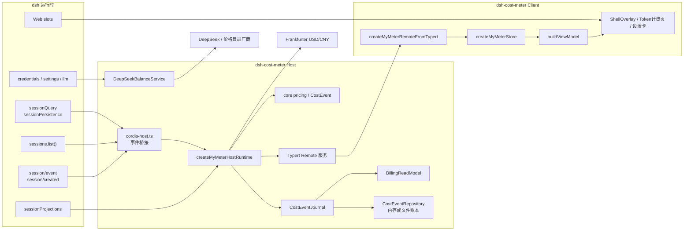
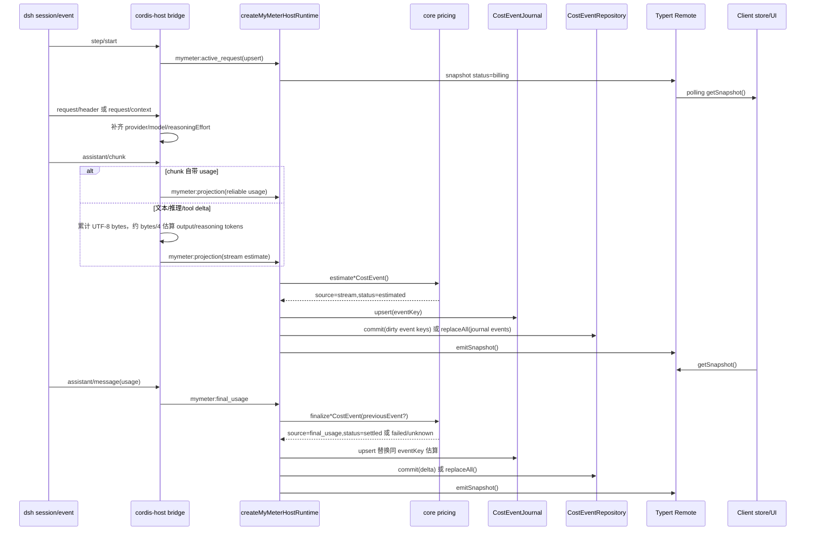

# dsh-cost-meter 架构与实现原理

本文面向维护者和贡献者，描述当前代码已经实现的边界、数据流和关键约束。凡是仍处于调研或计划状态的能力，会明确标注为未接入或仅有底层工具，避免把 proposal 当成事实。

## 系统边界

dsh-cost-meter 是 dsh 插件，不是厂商官方账单系统。Host 侧接收 dsh 会话事件、维护本地账本、读取 Host 凭据和 DeepSeek 余额；Client 侧只消费脱敏后的 Remote DTO 并渲染 UI。



隐私边界是硬约束：API Key、prompt、completion、messages、工具参数和请求/响应正文不进入 Client，不进入 Remote DTO，也不进入账本。流式文本只在 Host 内存里归约成 UTF-8 字节数，用于临时输出 Token 估算。

## Monorepo 包职责

| 包 | 主要职责 | 关键入口 |
| --- | --- | --- |
| `packages/shared` | wire 类型、金额/Token 基础类型、mock fixture、通用聚合桶 | `src/index.ts` |
| `packages/core` | 价格目录、provider billing registry、Token 规范化、费用计算、`CostEvent` journal、预算/缓存节省、峰谷倒计时、analytics、用量概览和远程价格更新策略 | `src/index.ts`, `src/pricing/*`, `src/analytics.ts`, `src/usage-overview.ts` |
| `packages/host` | Host 输入适配、JSON/append 账本、增量提交、原子写、聚合/read model、余额、用量概览、checkpoint、导出和远程价格下载库 | `src/index.ts`, `src/ledger-format.ts`, `src/balance.ts`, `src/usage-overview.ts` |
| `packages/client` | Remote snapshot 类型、浏览器 store、设置持久化、view model、费用洞察和 React 组件/按需分析面板 | `src/store.ts`, `src/view-model.ts`, `src/components.tsx` |
| `packages/plugin` | 发布包入口，连接 dsh Cordis Host/Client、历史回填、费用树、Typert Remote、自更新 RPC 和打包产物 | `src/cordis-host.ts`, `src/cordis-client.tsx`, `src/index.tsx`, `src/typert-remote.ts` |
| `packages/api` | 早期 Remote facade 与脱敏工具；当前生产插件主要经 `packages/plugin/src/typert-remote.ts` 暴露服务 | `src/index.ts` |

`packages/plugin` 是唯一发布到 npm 的包。其他 workspace 是源码分层，打包时由 esbuild 合入 `packages/plugin/lib/*` 并由 `tsc` 生成声明文件。

## Host / Client 加载

Host 入口是 `packages/plugin/src/cordis-host.ts` 的 `apply(ctx, config)`：

1. 注册 `mymeter` settings namespace。
2. 若配置了 `ledgerPath`，创建 `createFileCostEventRepository`；否则 Host runtime 使用内存仓库。
3. 默认创建 DeepSeek 余额 provider，除非 `balanceEnabled === false`。
4. 通过 `createMyMeterCordisHostRuntime` 订阅 dsh 会话事件并启动历史回填。
5. 用 `bindMyMeterTypertRemote(runtime.remote)` 将 Host remote 服务挂到 `ctx.reflect.provide("mymeter", service)`。
6. 注册 Typert 本地 contribution 和自更新 RPC。

发布包的 `cordis.patch.yml` 默认把 `ledgerPath` 设置为 `$DSH_HOME/mymeter/ledger.json`。上面的“否则使用内存仓库”主要适用于测试或直接调用 `apply(ctx, config)` 的自定义组合。

Client 入口是 `packages/plugin/src/cordis-client.tsx` 的 `apply(ctx)`：

1. 通过 `ctx.remote.$mount(MYMETER_REMOTE_CONTRIBUTION)` 挂载 Host remote 描述。
2. 调用 `createMyMeterRemoteFromTypert(namespace)` 建立浏览器端 Remote adapter。
3. 创建 `createMyMeterStore({ remote })`。
4. 向 dsh slots 注入 `shell.overlay`、`settings.plugin.item` 和 `conversation.view`。

打包配置在 `scripts/build-plugin.mjs`：Host 产物是 ESM `lib/index.js`，Client 产物是 CJS `lib/client.js` 并包上 `window.__ModuleLoader__.load({ id: "@mymeter/dsh-cost-meter", ... })`，Remote 和 invariant 也分别输出为 `lib/remote.js`、`lib/invariant.js`。

## 事件时序

`cordis-host.ts` 把 dsh 的持久会话事件转换成 dsh-cost-meter 内部事件。`index.tsx` 的 Host runtime 再把这些事件转换成 `CostEvent`，写入 journal、read model 和 repository。



重试相关事件有额外分支：`llm/retry` 记录下一次 `attemptId`；`llm/retry-started` 会清除旧 active request，并把上一 attempt 按失败处理。如果上一 attempt 只有 projection，就发 `mymeter:projection` 且带 `requestOutcome: "failed"`；如果有权威 usage，则发 `mymeter:final_usage`。

`turn/end` 用 `reason.kind` 归一化成 `success`、`aborted` 或 `failed`。如果请求从未观察到有效请求活动，只清除 active request，不写费用事件。

## Projection 到 Final 的状态转换

事件身份由 `sessionId:turnId:stepId:attemptId` 构成 `eventKey`。同一个 `eventKey` 上，projection 和 final usage 不是相加关系，而是替换/校正关系。

状态规则在 `packages/core/src/index.ts` 和 Host runtime 中共同体现：

| 场景 | source | status | 说明 |
| --- | --- | --- | --- |
| 流式估算 | `stream` | `estimated` | projection 来自 usage chunk 或 bytes/4 临时估算 |
| final usage 成功且模型/费率可识别 | `final_usage` | `settled` | 替换同 `eventKey` 的估算事件 |
| final 缺 usage 但有 previous estimate | 通常保留 `stream` | `estimated`，失败/中止时为 `failed` | 复制上一估算金额并设置 `correctionOfEventId` |
| provider 或模型无法解析 | `stream` 或 `final_usage` | `unknown` | 保留 Token，金额为 0，`unknownReason` 标注原因 |
| 请求失败或中止且有可用费用 | `stream` 或 `final_usage` | `failed` | 费用进入 total 和 failed 桶；UI 把 aborted 显示为 `aborted` |

`shouldReplaceCostEvent` 和 Host 账本的同名逻辑按优先级替换：`settled > failed > estimated > unknown`，source 优先级为 `final_usage > restored > projection > stream`。若同为 estimated 且金额不同，保留金额更大的事件；之后再按 completed/request 时间选择更新的事件。

## 目录解析与价格目录

价格目录位于 `packages/core/src/pricing/`：

- `deepseek.ts`、`xai.ts` 和每个新增厂商文件维护模型价格快照。
- `versions.ts` 集中维护价格版本字符串。
- `catalog.ts` 维护额外 USD 厂商目录、dsh provider 列表、route alias 和模型归属解析。
- `index.ts` 的 `resolvePricingCatalogKind(provider, model)` 决定一次请求应使用哪个价格目录。

解析策略是保守的：

1. provider 明确是 `deepseek` 或 `deepseek-official`，且模型是 DeepSeek 或 unknown，使用 DeepSeek 目录。
2. provider 是 `xai` 或 `cpa` 且模型命中 xAI，使用 xAI 目录。
3. `API_PRICING_PROVIDER_ALIASES` 只把已知 dsh route 映射到底层公开 API 厂商，例如 `openai-codex -> openai`、`kimi-coding -> moonshotai`。
4. 若 provider 不足以判断，会尝试按模型 ID 唯一命中某个额外目录。
5. 不能唯一归属或没有本地价格表时，返回 `null`，最终事件为 `unknown`，不会套用 DeepSeek 价格。

DeepSeek 有北京时间峰谷价，`resolveDeepSeekPricingZone` 按请求开始时间锁定 `09:00-12:00`、`14:00-18:00` 为 `peak`，其他为 `offpeak`。其他已登记 USD 厂商不使用峰谷，`pricingZone` 为 `unknown`。

## 金额精度

核心费用计算使用 `bigint`，单位如下：

- `MoneyMicroCny`：一元人民币的百万分之一。
- `MoneyMinor`：来源币种的百万分之一；对 USD 目录即 micro-USD。
- Token 按 `TokenCount = bigint` 存储，计价公式是 `round(tokens * ratePerMillion / 1_000_000)`。

Core 中 `priceTokens` 使用四舍五入除法，避免浮点累计误差。USD 厂商同时保留：

- 原币种字段：`currency: "USD"`、`amountMinor`、各 bucket 的 `*Minor` 和 `*RateMinorPerMillionTokens`。
- 兼容人民币字段：`amountMicroCny` 和各 bucket 的 `*MicroCny`。

发布快照内置的 USD/CNY 兼容折算率是 `1 USD = ¥7.20`，常量在 `pricing/common.ts`。Client 的“查询最新汇率”只用于多币种汇总展示，不回写 ledger，也不改变事件的原币种金额。

需要注意：Host 文件账本当前把 `bigint` 事件转换成 `number` 后落盘，因此 README 已明确存在 JavaScript safe integer 边界。新增超大金额或超长历史处理时，不应假设文件账本可无限精度存储。

## Journal、Read Model 与 Ledger

当前运行态有三层数据结构：

1. `CostEventJournal`：core 层按 `eventKey` 去重和替换，保留事件顺序，提供 `list()` 和 core 聚合。
2. `BillingReadModel`：Host runtime 内的按 `eventKey`、`sessionId` 建索引结构。它维护每个 session 的 generation，用于快速取得 session events 和判断是否有变化。
3. `CostEventRepository`：Host 层持久仓库接口。内存实现用于测试和未配置 `ledgerPath` 的运行；文件实现用于本地持久化。

Host runtime 初始化时，会先从 repository 读取历史事件，转换成 core `CostEvent` 后建 journal，再用 journal 重建 read model。之后每次 `upsert` 都先更新 journal/read model，再标记 `ledgerDirty` 和 `snapshotDirty`。`batch(callback)` 会推迟落盘和快照广播，直到最外层 batch 结束。若 Adapter 实现 `commit(delta)`，runtime 只提交 dirty `eventKey` 的增量；旧 Adapter 则回退为 `replaceAll(full journal)`。提交失败会保留 dirty batch，避免把尚未落盘的事件误标为已持久化。

`createRemoteSnapshot` 从 journal events、Host 聚合、read model session events、active requests、余额和汇率生成 Client DTO。返回的 snapshot 会 `deepFreeze`，避免被订阅者或测试意外修改。

## 原子写与恢复

文件账本实现位于 `packages/host/src/ledger.ts`：

- 格式为 `{ schemaVersion: 1, events: [...] }`。
- 每次写入前会 `mkdir -p dirname(filePath)`。
- 写入 `${filePath}.${pid}.${Date.now()}.tmp`，`fsync` 文件后 `rename` 到目标路径，再尝试 `fsync` 目录。
- 写失败时关闭 fd 并删除临时文件。
- 写入前 `mergeFromDisk` 会重新读取磁盘内容，与当前内存事件合并后再 persist，用于降低同进程内多个 repository 实例互相覆盖的风险。

读取恢复规则：

- JSON 损坏：原文件重命名到 `${filePath}.corrupt-<time>-<pid>`，返回空事件。
- schemaVersion 不等于当前版本：隔离为 `${filePath}.schema-<version>-<time>-<pid>`，返回空事件。
- 部分事件非法：隔离原文件，过滤可恢复事件后重写 ledger，并通过 `onRecovery` 报告保留/拒绝数量。
- 兼容旧格式：如果顶层不是对象但本身是数组，也会尝试按旧数组账本读取。

`packages/host/src/recovery-checkpoint.ts` 提供 `<ledgerPath>.recovery.json` 的 schema、原子写、读取和隔离逻辑。生产路径只有在 Host 配置了 durable `ledgerPath` 时才创建 checkpoint；自定义组合若使用内存账本，不会启用 checkpoint，也不会跨重启跳过历史。

checkpoint 保存 `sourceKey`、`projectionVersion`、账本 content fingerprint 和每个 session 的 revision。fingerprint 由规范化后的 `ledgerPath` 加上账本文件当前内容计算；账本不存在时也会得到稳定的 missing fingerprint。checkpoint JSON 损坏或 schema 不匹配会隔离 sidecar 并完整回放历史；metadata 或 ledger fingerprint 不匹配时不会信任旧 revision，也会完整回放历史。

启用 `ledgerFormat: append` 时，ledger format adapter 使用 generation manifest、snapshot 和 append log；启动时先做 owner/generation 校验，提交前再次检查 stale writer，检测到其他 writer 后拒绝提交并要求重开实例。generation 会在需要时 compaction；`exportToJson()` / `compactToJson()` 通过原子 schema-v1 JSON 导出支持回滚。JSON 与 append 之间的切换由 `packages/host/src/ledger-format.ts` 负责，JSON -> append 会保留 `.legacy.json` 备份，append -> JSON 会先校验导出结果再替换目标文件。

## 历史回填与竞态

历史回填实现位于 `packages/plugin/src/history-recovery.ts`，生产接线在 `createMyMeterCordisHostRuntime`：

- 启动列历史时优先使用 `sessionPersistence.listSnapshots()`，因为该路径可以直接提供 session `revision`；如果不可用或失败，再降级到 `sessionQuery.listSessions()`，最后使用 `sessionPersistence.list()`。
- 对于没有被 checkpoint revision 跳过、确实发生变化的 session，读取内容仍优先走 `sessionQuery.readSession()`；query 读取失败或不可用时再降级到 `sessionPersistence.inspect()`。
- 默认按 8 个 session 或 5000 个 events 分批回放，并在批次间 `setTimeout(0)` 让出事件循环。
- `session/created` 和 `session/event` 会调用 `history.markLive(sessionId)`，回填时遇到 live session 会跳过，避免冷启动回放覆盖正在发生的 live 请求。
- 启动时也会遍历 `ctx.sessions?.list()`，把已加载会话标记 live 并 seed 已有 events。
- `seededEventCounts` 记录已 seed 的 event 数；如果 live 事件先于 session 暴露的 events 数组追加，会用 `eventIsInHistory` 判断并单独桥接该事件，避免首个 live event 丢失。

回填 target 使用 `runtime.batch()`，因此一批历史事件只触发一次落盘和一次快照刷新。启用 durable `ledgerPath` 时，成功提交批次后会保存已提交 session revision，后续启动可跳过 revision 未变化的历史会话；损坏、schema 不匹配、source/projection/fingerprint 不匹配时会退回完整回放。live 账本提交后，checkpoint 的 ledger fingerprint 会以 250ms debounce 刷新，卸载时会 flush 待刷新的 checkpoint。幂等性仍依赖 `eventKey` 去重和同一事件替换规则。

## Remote DTO 与脱敏

生产 Remote 层在 `packages/plugin/src/typert-remote.ts`。它定义严格 schema 和 invocation descriptors：

- `getSnapshot()`
- `listSessions()`
- `getSessionDetail(sessionId)`
- `getSessionCostTree()`
- `getCostAnalytics()`
- `getUsageOverview({ range: "today" | "7d" | "30d", timeZone? })`
- `exportLedger(format)`（`json` 或 `csv`）
- `getBalance()`
- `refreshBalance()`
- `getSettings()`
- `refreshExchangeRate()`

Host 暴露的是聚合后的 `MyMeterRemoteSnapshot`、session summary/detail、余额、设置和汇率。DTO 只包含 provider、model、reasoningEffort、agentPreset、Token 分桶、费用、价格版本、上下文 breakdown 数字等展示数据。

`packages/api/src/index.ts` 仍保留通用 `createClientSafeEvent` / `stripSensitiveFields`，会递归移除 `apiKey`、`authorization`、`prompt`、`completion`、`messages`、`input`、`output`、`content`、`requestBody`、`responseBody`、`accessToken` 以及以 token/API key 结尾的字段。当前生产 Host remote 已经在源头构造安全 DTO，不依赖把原始 session event 直接传给 Client。

费用树、用量概览、趋势/异常报告和导出均按需计算，不塞入默认 `getSnapshot()`，以控制轮询 payload。用量概览只按上海自然日聚合今日/7 天/30 天：今日固定 24 个小时桶，其余范围按天补零；金额只累计已知价格事件，coverage 为 `complete`、`partial` 或 `unavailable`，未知价格在 UI 显示 `—`。Typert adapter 的 schema parser 会拒绝不合法字段类型、时间戳、桶数量或枚举值，失败时 Client adapter 保留同范围最近结果并标记错误。旧 Client 不支持按需方法时，adapter 仍可使用基本 snapshot、会话列表和详情能力。

## Client Store 与轮询

Client adapter `createMyMeterRemoteFromTypert` 启动时先 `getSnapshot()`，随后默认每 200ms 轮询轻量 Host snapshot。这一频率是为了在 provider final usage 到达前展示输出增量估算。余额请求与快照轮询解耦：首次快照后请求一次，之后默认每 5 分钟、页面恢复可见或用户手动点击“刷新余额”时更新；余额请求自带 10 秒超时、并发去重和失败退避，失败时保留 `stale` 或 `unavailable` 状态。

`createMyMeterStore` 负责：

- 保存 Remote snapshot、settings、UI 状态和派生 view model。
- 用 `localStorage` 持久化显示偏好，默认 key 是 `mymeter.settings`。
- 用 `mymeter:settings-change` 自定义事件和浏览器 `storage` 事件同步同页/跨页设置。
- 处理会话选择、固定会话、搜索/排序/过滤、刷新汇率和浮窗开关。
- `syncCurrentSession()` 在未固定会话且用户没有显式选择其他会话时，让浮窗跟随 dsh 当前会话。

浮窗位置字段保留在 settings shape 中，但页面加载时不从历史位置恢复；拖拽位置是当前页面实例内的临时状态。

`buildViewModel` 会把 Remote DTO 转成 UI 友好的金额、状态、提示和 session/stage/turn 结构。主状态由请求状态、active billing 状态和余额状态共同决定，优先级在 `STATUS_PRIORITY` 中定义。

## 余额与汇率

DeepSeek 余额实现位于 `packages/host/src/balance.ts`：

- Host 通过 dsh credentials 或环境变量解析 API key，默认引用是 `DEEPSEEK_API_KEY`。
- base URL 默认继承 `llm-deepseek.baseURL`、`DEEPSEEK_BASE_URL` 或 `https://api.deepseek.com`。
- 请求路径是 `/user/balance`，Header 使用 `Authorization: Bearer <key>`。
- 余额缓存默认 5 分钟；凭据或设置更新会清空缓存。
- 请求默认 10 秒超时；并发请求共享一个 inflight 请求，失败按 `30s / 60s / 5min` 退避，避免网络故障时重复打满余额接口。
- 可用响应转换成 micro-CNY 数字，优先选择 `balance_infos` 中 currency 为 CNY 的条目，否则用第一条。
- 请求失败且有缓存时返回 `stale`，无缓存时返回 `unavailable`。
- `refreshBalance()` 显式绕过余额 TTL，用于全局用量页的手动刷新；它不改变 200ms 快照轮询频率。

Provider balance 列表来自 dsh `llm.listProviders()` 和 `llm.listConfigurableProviders()`。当前只有 `settingsNs === "llm-deepseek"` 的 provider 标记为 `balanceSupported: true`，客户端余额区域会隐藏其他 provider，不会复用 DeepSeek 余额。

汇率刷新由 Host 的 `refreshExchangeRate()` 调用 `https://api.frankfurter.app/latest?from=USD&to=CNY`，8 秒超时。返回值只进入当前 Remote snapshot 的 `exchangeRate`，用于 `cnyEquivalentMicroCny` 展示。

## 构建与发布

常用命令：

```bash
npm run typecheck
npm test
npm run build
npm run pack:plugin
npm run verify:package
npm run verify
```

`npm run build` 等价于 `typecheck + build:plugin`。`verify:package` 会：

1. 检查 `packages/plugin/package.json` 的包名、public access 和导出产物。
2. `npm pack` 插件目录到临时目录。
3. 确认 tarball 不包含 `src/` 或 sourcemap，并且包含 `LICENSE`、`README.md`、`cordis.patch.yml` 和关键声明文件。
4. 将仓库根目录当前版本 tarball（例如 `mymeter-dsh-cost-meter-0.3.0.tgz`）与临时 `npm pack` 的发布文件逐文件 hash 比较；比较的是解压后的 package 文件内容，不依赖 gzip/tar 元数据。
5. 在临时 consumer 中 symlink 包和 React 类型，编译导入 `.`、`/host`、`/client`、`/remote`。
6. 用 Node 动态导入发布包主入口。

发布包的 `files` 只包含构建产物、声明、`cordis.patch.yml`、README 和 LICENSE。直接 Git 安装不受支持，因为源码构建依赖 workspace。由于 `verify:package` 会校验根 tarball 与当前临时 pack 一致，发布前应先完成 build 和 `npm run pack:plugin`；旧 tarball 或缺文件 tarball 必须失败。

## 测试分层

当前测试目录按风险面分层：

- `tests/core`：价格、provider registry、Token 规范化、费用、预算、缓存节省、analytics 和远程更新策略等纯逻辑。
- `tests/host`：JSON/append 账本、read model、余额、导出、自更新、远程价格下载、适配器和文件恢复。
- `tests/plugin`：历史回填批处理、取消、live session 竞态。
- `tests/integration`：Host runtime、Cordis 事件桥、Remote snapshot、stage metadata、打包契约。
- `tests/client`：store、controller、费用洞察、按需面板、UI 视觉契约和 React 组件行为。
- `tests/perf` 与 `tests/qa`：历史回填性能 fixture 和性能预算检查。

行为变化优先在最窄层写测试；跨 Host/Client DTO 或 dsh 事件桥的变化，需要补 integration 测试。仅文档修改通常不需要运行完整测试，但完成实现类改动前不要只依赖类型检查。

## 新增厂商扩展步骤

新增价格厂商时，按以下顺序做最小变更：

1. 在 `packages/core/src/pricing/<provider>.ts` 新增 provider 常量、价格来源、版本、模型价格表和必要 alias。
2. 在 `packages/core/src/pricing/versions.ts` 增加价格版本。
3. 在 `packages/core/src/pricing/catalog.ts` 导入新目录，把 provider 加入 `AdditionalPricingCatalogKind` 和 `ADDITIONAL_PRICING_CATALOGS`；如果 dsh route 与价格厂商不同，再更新 `API_PRICING_PROVIDER_ALIASES`。
4. 确认 `resolvePricingCatalogKind(provider, model)` 能通过 provider 或唯一模型归属解析到新厂商。
5. 为 `calculateProviderUsageCost` 路径补 core 测试：直接 provider、route alias、唯一模型命中、未知模型、cache write、长上下文 tier（若有）。
6. 补 integration 测试，确认 Host runtime 从 `request/header` 到 `assistant/message.usage` 能输出正确 provider、currency、priceVersion、Token bucket、session stage。
7. 如果厂商有余额接口，新增 Host balance service 和 provider wiring；如果没有，确保 UI provider balance 显示 unsupported。
8. 更新 README 和本架构文档中“支持目录/限制”的描述。

除非厂商官方明确以 CNY 计价，否则按 USD 原币种金额进入 `amountMinor`，同时保留人民币兼容金额用于本地总计。

## 关键不变量

- 同一次请求的唯一身份是 `sessionId + turnId + stepId + attemptId`；缺任一字段时 Host runtime 不应生成费用事件。
- 同一 `eventKey` 的 projection 与 final usage 必须替换，不能累加。
- 未识别 provider/model 时金额必须为 0 且状态为 `unknown`，不能套用默认 DeepSeek 价格。
- 已结算事件重放时应保留记录中的价格快照；非 settled 的 restored/projection 事件才会按当前目录重估。
- `requestStartedAt` 决定 DeepSeek 峰谷价；完成时间只用于活动排序和 stage 结束时间。
- `reasoningTokens` 已包含在输出计价中，明细中“其中推理”金额为 0，不能再次计费。
- Host/Remote/Client 不得传递 API Key、prompt、completion、messages、工具参数或正文内容。
- 文件账本写入必须走临时文件、`fsync`、`rename` 的原子写路径。
- 历史回填必须跳过 live session，并且通过 eventKey 去重保持幂等。
- active request 只影响当前 billing 展示；没有 projection/final usage 时不应凭 active request 生成账本费用。
- 余额是厂商账户级快照，不是模型级或会话级费用；unsupported provider 不能显示其他 provider 的余额。
- 最新 USD/CNY 汇率只用于展示折算，不改变 ledger 中的原币种金额和价格版本。
